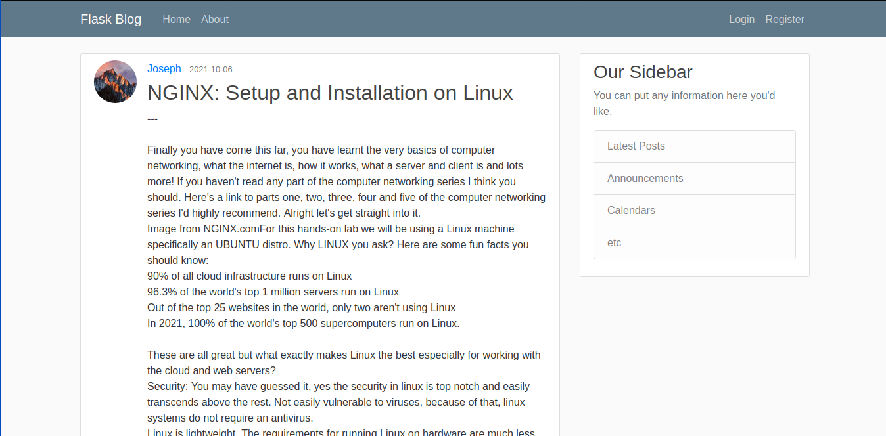
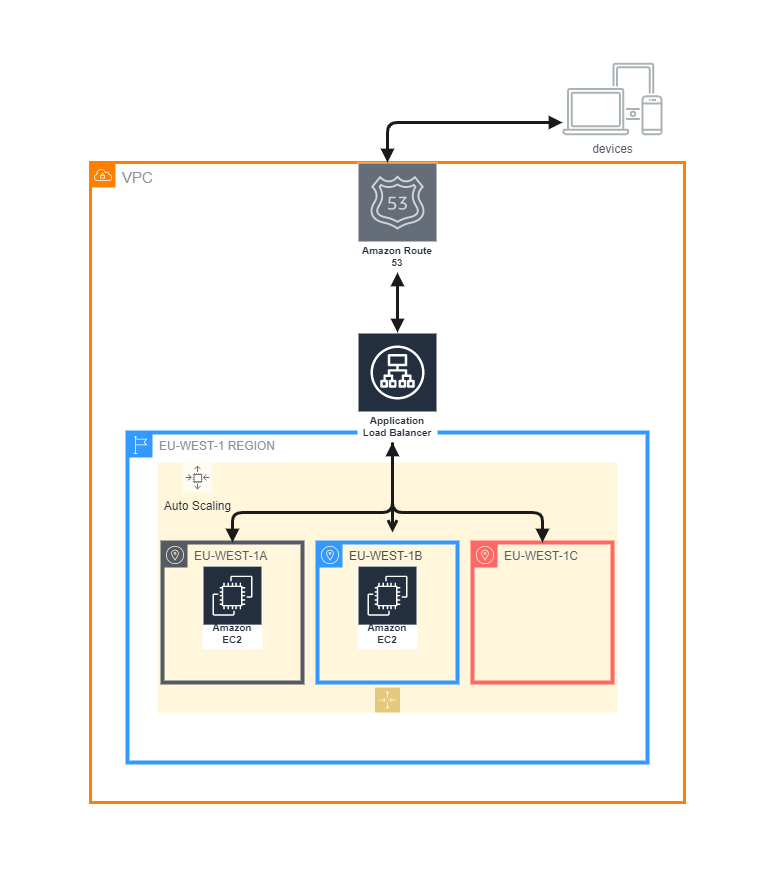

# Flask Blog

# Introduction
This FlaskBlog web application is simply built with the micro-web framework **Flask**, HTML and the CSS framework **Bootstrap**. Different features in this application such as user authentication and password reset via email was all made possible with the aid of the available functionalities in flask such as Flask-WTF, Flask-Login, Flask-Mail etc.

# Deployment
The web application has been deployed on AWS to EC2 instances set up in an autoscaling group in different AZs (Availability Zones), with an Elastic Load Balancer attached to a target group containing the EC2 instances. Here is the URL to access the web application [link](joeshiett.xyz). 

Before each EC2 instance was created and configured to serve the web application, an AMI image was created. 
- 